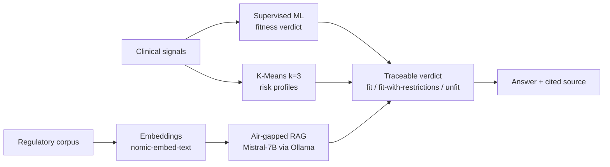

<h1 align="center">Medical-Aeronautic RAG Engine</h1>

<p align="center"><i>Defensible AI for medical-fitness decisions — a verdict is never issued without a citable source.</i></p>

<p align="center">
  
  
  
  
  
  
</p>

> **Note** — This is the open technical engine. The user-facing product built on top of it (**AeroFit**, my final-year capstone) lives in a private repo.

## The problem

Aeromedical fitness decisions have to be **traceable**: an examiner must be able to see *why* a pilot was flagged and *which regulation* backs it. A model that just outputs "unfit" with no provenance is useless in a regulated domain — and a language model that hallucinates a rule is worse than useless.

This engine is built around one rule: **it never answers outside its sources.** Every RAG response cites the regulation it came from; every ML verdict is tied to the clinical variables that produced it.

## Features

- **Dual-engine architecture** — a supervised ML classifier for the fitness verdict, plus an air-gapped RAG engine for the regulatory reasoning behind it.
- **Risk-first tuning** — the classifier is optimized for **recall on the risk class**, because a missed at-risk pilot costs far more than a false alarm.
- **Latent-profile segmentation** — unsupervised K-Means (k=3) surfaces risk profiles that aren't explicit in the labels.
- **Air-gapped RAG** — Mistral-7B via Ollama with `nomic-embed-text` embeddings over a public regulatory corpus. Runs fully local; no clinical data leaves the machine.
- **CRISP-DM workflow** — reproducible pipeline from raw data to validation.

## Architecture



## Quickstart

```bash
git clone https://github.com/akhanER2000/Local-RAG-medical-assistance-aeronautic.git
cd Local-RAG-medical-assistance-aeronautic
pip install -r requirements.txt
ollama pull mistral && ollama pull nomic-embed-text
jupyter notebook   # open the pipeline under notebooks/
```

## Stack

Python · Jupyter · scikit-learn · Ollama (Mistral-7B) · `nomic-embed-text` · Retrieval-Augmented Generation

## Results

- **0.65 recall on the risk class** — deliberately traded precision for recall, because a missed risk is the expensive error.
- Verdicts are **fit / fit-with-restrictions / unfit**, each returned with its supporting regulation.

## Status & roadmap

`status: flagship` · active. Next: expand the regulatory corpus and add per-verdict confidence surfacing.

## License & contact

MIT © 2026 Akhan Lorenzo Espinoza Rojas
[Portfolio](https://cs-portfolio-psi-topaz.vercel.app) · [LinkedIn](https://www.linkedin.com/in/akhan-espinoza)
